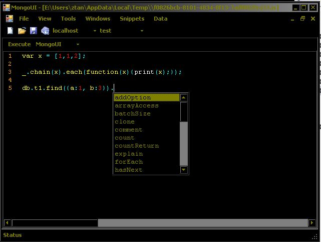

MongoUI
=======

MongoUI is a bear-bone mongo mananger modeled after sql server manager, where multiple queries and query results are handled in separate windows.  

###Core features: ###

  - Opens queries in separate windows.
  - Switches easily amongst servers and databases.
  - Outputs results to desired exe (notepad) or inside a pane.
  - Allows inclusion of libraries such as Underscore.js.

###Additional features: ###

  - Pops confirmation dialog before query execution, depending on server configuration.</td></tr>
  - Reopens all files opened in previous session.</td></tr>
  - Stores static list of files for quick access.</td></tr>

###Features in progress: ###

  - Autocomplete (implemented "db.collection." and "db.collection.find()")

###Snapshot: ###
</image>
